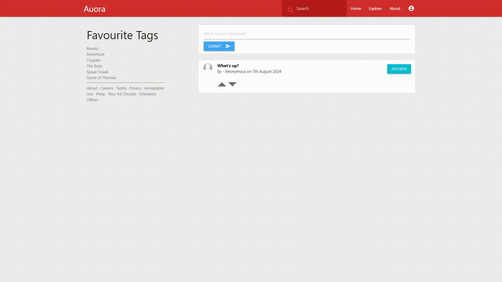

# 🔥 Auora (A Quora Clone Project)

## ⚠️ Steps of Usage

1. Install node.js
2. Install MongoDB
3. Create 'quora' document and 'questions' collection
4. Run `npm install mongodb` in the project
5. Run `npm install express` in the project
6. Run server.js - `node server.js`
7. Open http://localhost:3000/

